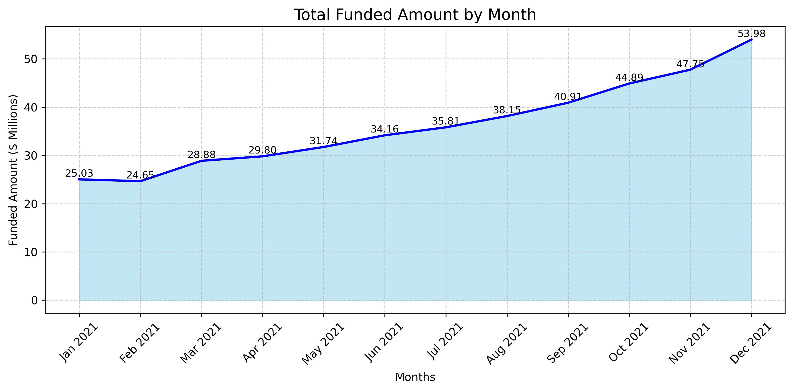

# Bank-Loan-Analysis-Python

# 🏦 Bank Loan Analysis (Data Analytics Project)

A complete end-to-end **loan portfolio analysis** designed to help the bank understand **loan performance, borrower behavior, portfolio risk, and profitability**.  
This project uses **Python (Pandas, Matplotlib, Seaborn)** for data cleaning, KPI derivation, exploratory data analysis (EDA), and visualization.

      

---

## 📚 Table of Contents

- [🏦 Bank Loan Analysis (Data Analytics Project)
- [📌 Business Problem / Problem Statement]
- [🧩 Project Objectives]
- [📊 Results Snapshot]
- [🛠️ Tools & Technologies Used]
- [📊 Dataset Description]
- [📈 BRD 1 — KPI Requirements]
- [🔄 BRD 1 — Good Loan vs Bad Loan Analysis]
- [📉 BRD 2 — Visualization Requirements & Chart Insights]
- [🧠 Key Insights Summary]
- [🏦 Business Recommendations]
- [🧾 Final Conclusion: Loan Portfolio Risk & Strategy]
- [📁 Project Structure]
- [🧑‍💻 Author]

---

## 📌 Business Problem / Problem Statement

The bank receives thousands of loan applications across different states, income groups, employment backgrounds, and loan purposes. However, the bank lacks clear visibility into:

- Borrower repayment behavior  
- Loan profitability & losses  
- Seasonal trends in loan demand  
- High-risk vs. low-risk customer groups  
- Operational lending KPIs  

To solve these challenges, the bank requires an in-depth analysis of its loan portfolio across multiple KPIs, borrower segments, loan types, and repayment patterns.  
**The goal is to strengthen underwriting decisions, reduce charge-offs, improve profitability, and optimize lending strategy.**

---

## 🧩 Project Objectives

✔ Calculate all core lending KPIs  
✔ Compare Good Loans vs Bad Loans  
✔ Identify high-risk & profitable borrower segments  
✔ Analyze trends by month, state, term, employment length, purpose & home ownership  
✔ Provide business recommendations to reduce losses and increase ROI  

---

## 📊 Results Snapshot

- ✅ Portfolio Net Profit: **$37.31 Million**
- 📉 Total Loss from Bad Loans: **$28.25 Million**
- 💼 Good Loan Success Rate: **86.18%**
- 🏆 Top Low-Risk Groups: **Mortgage holders & 10+ year employees**
- ⚠️ High-Risk Groups: **Renters & <1 year employment**
- 🌍 Highest-performing state: **California (CA)**

---


---

## 🛠️ Tools & Technologies Used

| Tool | Purpose |
|------|---------|
| **Python** | Data analysis & visualization |
| **Pandas** | Data cleaning, preprocessing, aggregation |
| **Matplotlib / Seaborn** | KPI charts & EDA visualizations |
| **Jupyter Notebook** | Exploratory analysis & reporting |
| **CSV / Excel** | Dataset source |

---

## 📊 Dataset Description

The dataset contains information on borrower demographics, financial metrics, loan attributes, and repayment status.

**Preprocessing performed:**
- Removed missing or invalid values  
- Standardized formats (dates, categories, percentages)  
- Converted DTI, income, term & interest rate into numeric formats  
- Derived month & year columns  
- Categorized loans into **Good Loans (Fully Paid)** and **Bad Loans (Charged Off)**  
- Filtered incomplete or irrelevant rows  
- Prepared aggregated datasets for KPIs & charts  

---

## 📈 BRD 1 — KPI Requirements

| KPI | Value |
|------|-------|
| **Total Loan Applications** | 38,576 |
| **Total Funded Amount** | $435.76M |
| **Total Amount Received** | $473.07M |
| **Net Portfolio Return** | $37.31M |
| **Average Interest Rate** | 12.05% |
| **Average DTI** | 13.33% |

### 🔍 Insights  
- Strong demand with 38k+ loan applications  
- Healthy repayment inflow exceeding total funded amount  
- 12% interest rate indicates moderate lending risk  
- Low DTI reflects financially stable borrowers  

---

## 🔄 BRD 1 — Good Loan vs Bad Loan Analysis

### ✅ Good Loans (Fully Paid)
- Applications: **33,243**  
- Funded Amount: **$370.22M**  
- Amount Received: **$435.79M**  
- Share: **86.18%**  
- **Profit: $65.56M**

**Insight:**  
Good Loans form the bank’s profitable foundation but are highly concentrated in specific states and loan purposes.

---

### ❌ Bad Loans (Charged Off)
- Applications: **5,333**  
- Funded Amount: **$65.53M**  
- Amount Received: **$37.28M**  
- Share: **13.82%**  
- **Loss: $28.25M**

**Insight:** 
Bad Loans are the main source of losses and require tighter underwriting and better borrower assessment.

---

## 📉 BRD 2 — Visualization Requirements & Chart Insights

### 1️⃣ Total Funded Amount by Month  

&nbsp;
**Insight:** 
Funding is stable with a strong rise in December, indicating peak demand.

### 2️⃣ Total Received Amount by Month 

&nbsp; 
**Insight:** 
Repayments follow the same pattern — highest collection in December.

### 3️⃣ Total Loan Applications by Month 

&nbsp; 
**Insight:** 
Consistent demand with a noticeable year-end increase.

### 4️⃣ Total Funded Amount by State  

&nbsp;
**Insight:** 
California dominates funding — a major regional concentration risk.

### 5️⃣ Total Amount Received by State 

&nbsp;
**Insight:**  
CA also generates the highest repayments — confirms over-dependency.

### 6️⃣ Total Funded Amount by Term  

&nbsp;
**Insight:** 
36-month loans are the preferred and most funded option.

### 7️⃣ Total Amount Received by Term  

&nbsp;
**Insight:** 
Shorter-term loans produce maximum repayments.

### 8️⃣ Total Funded Amount by Employee Length  

&nbsp;
**Insight:** 
10+ year employees receive the most funding; <1 year employees remain high-risk.

### 9️⃣ Total Amount Received by Employee Length  

&nbsp;
**Insight:** 
Long-term employees generate reliable and high repayments.

### 🔟 Total Funded Amount by Loan Purpose

&nbsp;
**Insight:**   
Debt Consolidation dominates — a single point of product risk.

### 1️⃣1️⃣ Total Amount Received by Loan Purpose  

&nbsp;
**Insight:** 
Debt Consolidation also leads revenue — increasing dependency risk.

### 1️⃣2️⃣ Total Funded Amount by Home Ownership  

&nbsp;
**Insight:** 
Mortgage holders receive the most funding — lowest risk group.

### 1️⃣3️⃣ Total Amount Received by Home Ownership  

&nbsp;
**Insight:** 
Mortgage owners drive the highest repayments.

---

## 🧠 Key Insights Summary

- Portfolio is profitable with **$37.31M net return**  
- **86% Good Loans** demonstrate strong lending practices  
- **Bad Loans cause $28.25M loss** — key risk area  
- Heavy dependency on **CA, Debt Consolidation, 36-month loans**  
- Most reliable customers: **Mortgage holders + 10+ year employees**  
- Highest-risk customers: **Renters + <1 year employment**  
- December is the peak month for applications, funding, and repayments  

---

## 🏦 Business Recommendations

### 📌 1. Improve Risk Control  
- Stricter underwriting for renters & new employees  
- Apply risk-based pricing for high-risk groups  
- Strengthen DTI and income verification  

### 📌 2. Reduce Concentration Risk  
- Expand lending into TX, NY, FL, and other states  
- Reduce dependency on Debt Consolidation loans  
- Diversify product offerings  

### 📌 3. Strengthen Collections  
- Improve early-stage collection reminders  
- Increase recovery efforts for high-risk borrowers  

### 📌 4. Optimize Lending Profitability  
- Focus on long-term employees & mortgage holders  
- Promote 36-month loans — highest repayment efficiency  

---

## 🧾 Final Conclusion: Loan Portfolio Risk & Strategy 🎯

*The analysis confirms the bank’s loan business is in a phase of **rapid, profitable growth**, but with significant risk concentration in a few key areas.*

### Key Takeaways:
- **Profitability:** The bank earns **37.31M Dollar net profit** despite $28.25M losses.  
- **Risk Concentration:** Over-reliance on **Debt Consolidation loans** and **California market** poses serious exposure.  
- **Customer Insights:**  
  - Reliable: **10+ years employed**, **Mortgage holders**  
  - Risky: **Renters**, **<1 year employed**

### 🔑 Recommended Actions:
1. **Tighten Underwriting** for Debt Consolidation loans.  
2. **Implement Risk-Based Pricing** for Renters and short-term employees.  
3. **Diversify Markets** beyond California to reduce regional dependency.  

### ✅ Outcome:
By improving risk control and portfolio balance, the bank can **increase profits**, **reduce default losses**, and build a **sustainable, data-driven lending strategy**.

---

## 📁 Project Structure
```
├── Bank Loan Analysis.ipynb      # Main analysis notebook
├── Bank_loan_data.csv            # Dataset file
├── Business Problem              # Business Problem
├── Bank Loan Analysis Report.pdf # Full Project Report
│
├── images/                       # Folder containing chart images
│ ├── 01_Total_Funded_Amount_by_Month.png
│ ├── 02_Total_Received_Amount_by_Month.png
│ ├── 03_Total_Loan_Applications_by_Month.png
│ ├── 04_Total_Funded_Amount_by_State.png
│ ├── 05_Total_Amount_Received_by_State.png
│ ├── 06_Total_Funded_Amount_by_Term.png
│ ├── 07_Total_Amount_Received_by_Term.png
│ ├── 08_Total_Funded_Amount_by_Employee_Length.png
│ ├── 09_Total_Amount_Received_by_Employee_Length.png
│ ├── 10_Total_Funded_Amount_by_Loan_Purpose.png
│ ├── 11_Total_Amount_Received_by_Loan_Purpose.png
│ ├── 12_Total_Funded_Amount_by_Home_Ownership.png
│ └── 13_Total_Amount_Received_by_Home_Ownership.png
│
└── README.md                     # Project documentation
```

---

## 🧑‍💻 Author

**👤 Kiran Bhardwaj**  
📍 Data Analyst | Python | SQL | Power BI | Excel | Data Visualization  
📬 [LinkedIn](https://www.linkedin.com/in/kiran-bhardwaj-b34a29317/) | 🔗[GitHub](https://github.com/BhardwajKiran)

📧 [kbhardwaj.me@gmail.com](mailto:kbhardwaj.me@gmail.com)

---

⭐ *If you found this project helpful, feel free to star the repo and connect with me for collaboration!* 
